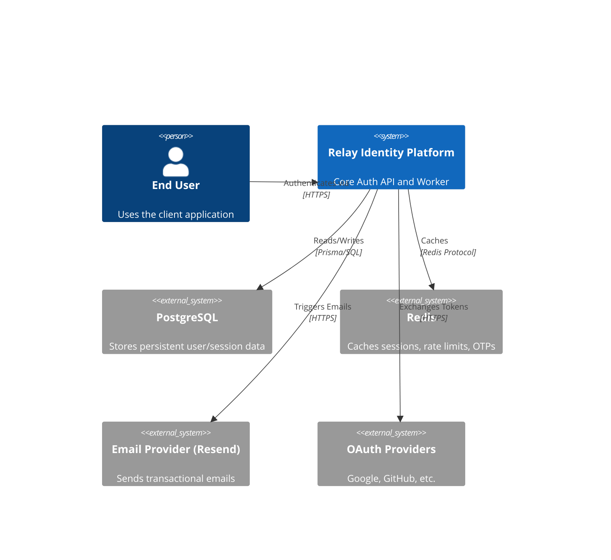
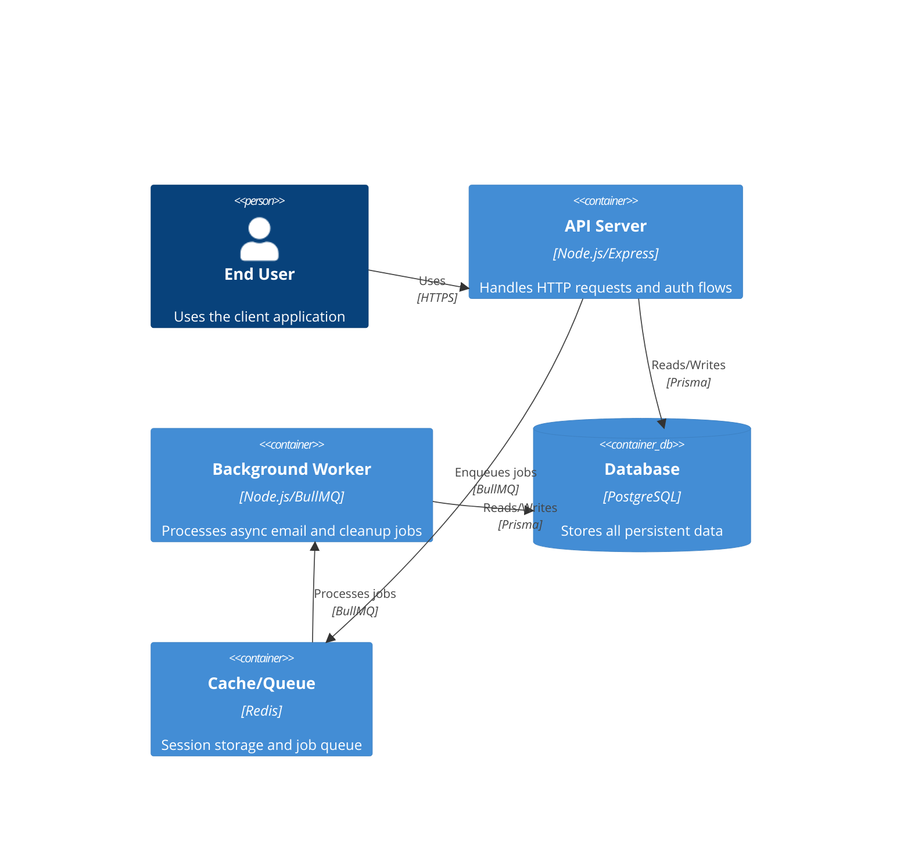

# Architecture — Relay Identity Platform

> **Last updated:** 2026-08-09
> **Status:** Current

## Overview

Relay is an enterprise-grade multi-tenant identity and authentication backend platform. It serves as a central authentication and authorization layer for modern web applications. It handles user authentication, session management, background jobs, and provides a versioned REST API built on Express 5, Prisma (PostgreSQL), Redis, BullMQ, and React Email.

---

## Level 1 — System Context

Relay is a standalone identity provider API that integrates with frontend applications and third-party services to securely handle user identities and session states.



**External dependencies:**

| System     | Purpose                                                            |
| ---------- | ------------------------------------------------------------------ |
| PostgreSQL | Primary persistent storage for users, sessions, audit events, etc. |
| Redis      | Caching, session rotation storage, BullMQ background jobs          |
| Resend     | Transactional emails (verification, magic links, OTP)              |

---

## Level 2 — Containers

Relay is a Modular Monolith deployed as two primary containers:



**Container inventory:**

| Container  | Technology            | Responsibility                                   |
| ---------- | --------------------- | ------------------------------------------------ |
| API Server | Node.js 22, Express 5 | Business logic, REST endpoints                   |
| Worker     | Node.js 22, BullMQ    | Background jobs, email dispatch, cron            |
| Database   | PostgreSQL 16         | Persistent data storage (Users, Sessions)        |
| Cache      | Redis 7               | Job queues, rate limits, session rotation hashes |

---

## Key Architectural Decisions

- **Modular Monolith**: Organized into self-contained domain modules with clear boundaries.
- **Asymmetric JWTs (RS256)**: Access tokens are signed with RS256 private keys; verification only requires public keys.
- **Opaque Refresh Tokens**: Refresh tokens are cryptographically random strings, hashed in the database, and rotated on every use to detect token reuse.
- **Background Processing**: Emails and heavy cleanup tasks are offloaded to BullMQ to prevent blocking the API thread.

---

## Directory Structure

```text
relay/
├── .github/          # CI/CD pipelines
├── infra/            # Docker Compose and infrastructure config
├── prisma/           # Database schema and migrations
├── src/
│   ├── config/       # Environment parsing, db singletons
│   ├── modules/      # Domain modules (auth, users, sessions, admin)
│   ├── shared/       # Cross-cutting concerns (middleware, utils)
│   ├── workers/      # BullMQ background jobs
│   ├── emails/       # React Email templates
│   ├── server.ts     # API entry point
│   └── worker.ts     # Worker entry point
└── docs/             # Architecture, ADRs, Concepts, and How-Tos
```

---

## Related Documents

- [Login/Logout Flows](./docs/architecture/003-login-logout-flow.md)
- [Auth Contract & Endpoints](./docs/architecture/004-auth-contract.md)
- [Email Design System](./docs/architecture/005-email-design-system.md)
- [Authentication Methods](./docs/concepts/001-authentication-methods.md)
- [JWT Guide](./docs/concepts/002-jwt-guide.md)
- [CI/CD Workflow](./docs/concepts/003-git-cicd-workflow.md)
- [AWS Infrastructure](./docs/concepts/004-terraform-aws-infra.md)
